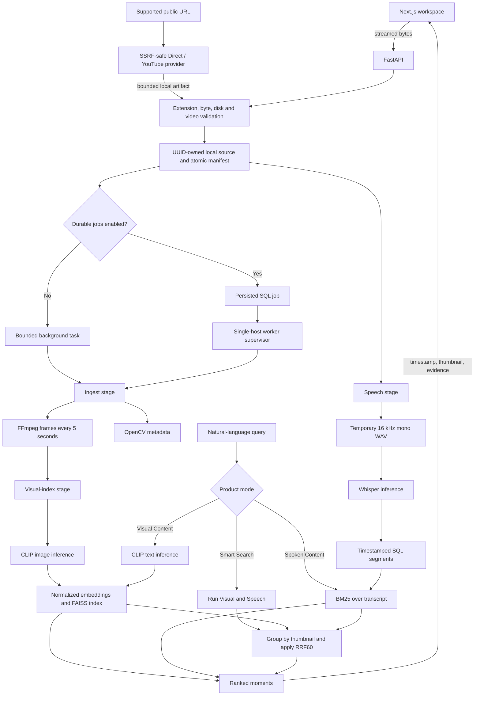

# SceneMind architecture

SceneMind is a single-operator, local-first video search application. Its production search
core is frozen at five-second frame sampling, CLIP/FAISS Visual retrieval, Whisper/BM25 Speech
retrieval and uncapped RRF60 Hybrid ranking.

Ask Video remains disabled. Its rejected Structured-Question Evidence V1 branch preserves the existing 45-second/900-character BM25 Top-5 base. Ordinary questions use that list unchanged. Explicit list/count questions may add at most three deduplicated adjacent chunks. Temporal questions localize a lexical anchor over one- or two-segment windows and add at most two transcript segments strictly before or after it. Total evidence is bounded to eight units, 6,000 characters and a 90-second local window. The backend validates evidence roles, timestamp direction, exact explicit list count, distinct claims and server-resolved citations. Frozen validation showed that these structural checks do not validate semantic premise or type compatibility, so the branch is not production architecture and the feature flag stays off.

## End-to-end data flow

## Upload and storage

`POST /videos` accepts MP4, MOV, WebM, MKV and AVI names, streams the request directly to disk,
and enforces the configured byte limit without buffering the complete file in memory. A declared
oversize request is rejected before allocation; the streamed byte counter remains authoritative.
Disk checks retain a fixed reserve plus source-relative processing headroom.

Each video owns a UUID directory below `SCENEMIND_DATA_DIR`. `folder_for` canonicalizes UUID input,
so callers cannot construct arbitrary paths. OpenCV verifies a readable video stream, positive
metadata, the duration limit and the 4K pixel bound. FFmpeg extracts scaled JPEGs into a temporary
directory. Only a complete result replaces the live frame directory, and the manifest is written
through an atomic temporary file.

The browser polls `/videos` and displays real states: waiting, extracting frames, ready or failed.
It never invents a percentage.

## Visual retrieval

The Visual stage loads the pinned `openai/clip-vit-base-patch32` revision, applies its matching
processor, encodes JPEG batches and L2-normalizes the output. Embeddings are stored locally and
loaded into FAISS `IndexFlatIP`. Because query and frame vectors are normalized, inner product is
cosine similarity. Exact search is appropriate for the measured local collections and avoids an
approximate-index tuning surface.

At query time CLIP encodes text and FAISS returns frames with timestamps. Five-second sampling is a
known recall boundary: content between samples cannot be recovered by the retriever.

## Speech retrieval

The Speech stage extracts a temporary mono 16 kHz WAV, runs configurable faster-whisper inference,
validates segment timestamps and replaces database rows transactionally. Segment ends are clipped
to playable duration and fully out-of-range tails are discarded. The WAV is deleted in `finally`.

BM25 uses `k1=1.2` and `b=0.75` to rank transcript segments. Speech thumbnails use the nearest
sampled frame, while the seek timestamp is the segment start. BM25 is lexical: exact phrases and
rare terms work well, while paraphrases can fail.

## Product modes and fusion

- **Smart Search** directly selects Hybrid and is the UI default.
- **Spoken Content** directly selects Speech.
- **Visual Content** directly selects Visual.
- **AUTO** remains an API-compatible experimental route and is outside the normal v1.0 interface.

Hybrid retrieval groups contributions by exact nearest-frame thumbnail. Within each modality only
the best contribution to a thumbnail counts. The score is the sum of `1 / (60 + rank)`. This
uncapped RRF60 baseline avoids comparing incompatible CLIP and BM25 raw values. It has a documented
failure mode: weak evidence from both modalities can outrank strong evidence from one modality.
Alternative caps, calibrated raw-score fusion and evidence-preserving rank quotas failed frozen
gates, so runtime behavior remains unchanged. The evidence-preserving candidate exists only under
`ml/experiments/evidence_preserving_fusion_v1`; it reserves one unique Top-5 bucket from each lane
and fills the remainder in production RRF order. Its aggregate validation gain came only from
Speech while Hybrid MRR regressed, so it is not imported by the backend.

Responses include timestamps, thumbnails, evidence type and transcript excerpts where available.
The UI hides raw scores and presents results as possible matches.

## Durable processing

Inline mode is the simplest local path. With `SCENEMIND_DURABLE_JOBS=true`, upload and stage requests
enqueue SQL jobs and return. One worker supervisor per shared data directory claims jobs with
compare-and-set transitions. It starts a reusable spawned inference child so model weights can stay
warm across jobs.

Retries are bounded and receive persisted backoff. Each kind has a configurable deadline. On a
deadline or crashed child, the supervisor terminates the process tree and removes only disposable
partial artifacts. Worker locks prevent multiple supervisors or inference writers from owning the
same local directory. Delivery is at-least-once; stage operations are designed to replay safely.

## Persistence

- Atomic JSON manifests own video metadata and frame state.
- Local NumPy/FAISS-compatible artifacts own visual embeddings and index metadata.
- SQLAlchemy models store transcripts, segments and durable jobs.
- Alembic migrations run at API/worker startup with SQLite immediate locking or a PostgreSQL
  advisory transaction lock.
- SQLite is the verified simple local default. PostgreSQL migration and queue behavior have a
  disposable validation path.

Uploaded media, frames, audio intermediates, embeddings, indexes, databases, model weights and
caches are ignored by Git.

## URL acquisition

`POST /videos/import-url` creates the same UUID-owned video record as upload and queues a durable
`acquire` job. Provider code lives in `app.url_ingest`; Direct Media streams with manual validated
redirects, while the YouTube adapter wraps pinned yt-dlp with structured metadata, a 720p ceiling,
process timeout and live output-size monitoring. After acquisition the existing `inspect_video`
and `ingest` job remain authoritative. Provenance lives in the atomic manifest; retryability lives
on the normal durable job row through migration 003. Search modules never branch on source type.

## Transcript-grounded Ask Video

Ask Video is a separate Q&A evidence layer over the existing SQL transcript. It groups ordered
Whisper segments into deterministic chunks bounded by 45 seconds and 900 characters with one
segment of overlap. Each chunk carries a stable evidence ID, video ID, start/end timestamps, text,
and underlying segment IDs. The existing BM25 implementation ranks chunks without changing
production Speech Search.

The `AnswerGenerator` boundary receives one question and the selected evidence. Ordinary questions
retain at most five chunks. The rejected structured branch can expand to eight bounded evidence
units. A deterministic analyzer extracts explicit count, temporal and relation constraints. The
OpenAI Responses implementation requests strict structured JSON with an answerability decision,
separately cited claims, temporal roles and missing requirements; response storage is disabled. The
model returns evidence IDs, never timestamps. The backend rejects unknown IDs, uncited claims,
declared evidence gaps, duplicate list claims, wrong explicit counts, invalid temporal roles and
wrong timestamp direction, then resolves citations to original timestamps. An invalid contract
safely abstains. No positive lexical evidence causes a pre-provider abstention.

`POST /videos/{id}/ask` requires a ready video, ready non-empty transcript, the feature gate and a
local provider key. `GET /videos/{id}/ask/status` exposes only enabled/configured state and model
name. Upload and URL provenance do not alter this path. The feature is disabled by default after
Decision D; structured validation failed correctness, grounding, citation, abstention and
hard-negative safety gates. Find Moments, BM25 Top-5 and general transcript chunking are unchanged.

## Failure handling

Upload failures remove the partial UUID directory. Failed frame extraction removes staged and live
partial frames. Visual artifacts are promoted atomically. Transcript replacement is transactional.
The durable supervisor marks abandoned running jobs failed on restart, applies bounded retry, and
exposes terminal errors for explicit retry. Inline startup marks interrupted stages failed rather
than pretending they completed.

Public error messages are bounded. The UI handles backend unavailability, invalid or oversized
uploads, processing failure, search/index failure and empty result lists. Optional Basic/Bearer
authentication protects all endpoints except health; cross-origin writes are limited to configured
origins.

## Resource model

The default envelope is 1 GiB and 60 minutes. Upload API memory stayed near 110 MB in measured
419 MiB and 45-minute runs because bytes stream to disk. The 45-minute sequential Whisper/CLIP run
completed in 245.4 seconds and peaked at about 3.02 GB across the worker process tree. Completed
storage was 1.064× source size, and temporary residue was zero.

Model loading dominates cold search. Final English Acceptance V2 measured a 10.42-second first
CLIP-backed search and 46–252 ms for the next 29 requests. Hardware, content and model cache state
will change these values.

## Deployment boundary

SceneMind is a local single-operator application. Optional authentication is not tenant ownership
or RBAC. Public TLS termination, object storage, user quotas, distributed leases, high availability
and untrusted multi-user isolation are outside v1.0. Use one API and one durable worker per shared
local data directory.

The Docker/Compose files validate the backend, PostgreSQL and job foundation. The base image does
not install the complete ML environment or serve the frontend. Full containerized ML deployment is
not claimed.

## Evaluation boundary

Production modules live under `backend/app`. Candidate models and ranking methods live under
`ml/experiments` and cannot enter runtime implicitly. Evaluation uses source-disjoint splits,
checksum-frozen manifests and query-level reports. Protected holdout evidence is not a tuning set.
The current search core is frozen for `1.0.0-rc1`. Evidence-Preserving Hybrid Fusion V1 used
development and one source-disjoint validation split, stopped at its cross-category gate, and did
not consume Hybrid Holdout V1. Speculative work is Future Work.

See [README.md](README.md), [long-video support](docs/LONG_VIDEO_SUPPORT.md),
[DECISIONS.md](DECISIONS.md), and the [portfolio case study](docs/PORTFOLIO_CASE_STUDY.md).
