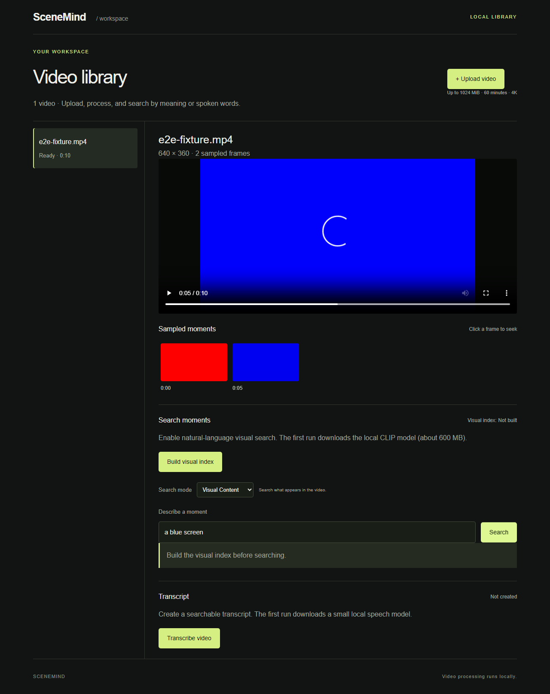
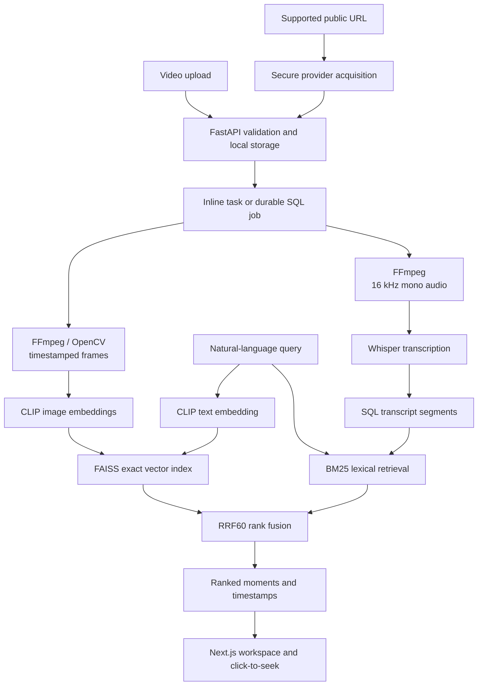

# SceneMind

SceneMind is a local-first multimodal video search engine that finds relevant moments in long
videos from natural-language queries.

Upload a video or import a supported public video URL, build local visual and speech indexes, search for what appears or what is said,
then click a ranked result to jump directly to its timestamp. SceneMind v1.0 RC uses pretrained
models for inference; it does not train CLIP or Whisper and does not require a paid API.

An evaluation-gated **Ask Video** path can produce transcript-grounded answers with clickable
timestamp citations through a configured OpenAI provider. It is disabled by default: Final Core
Acceptance reached 100% retrieval, grounding, citation precision, hard-negative abstention and
scope rejection, but only 83.33% answer correctness and core user success. Find Moments remains
fully local.

A later source-disjoint semantic/hierarchical experiment improved evidence completeness but reduced
answer correctness to 63.64% and failed on a 44-minute talk. That branch was rejected and remains
isolated from the product; Ask Video still uses no semantic index and stays disabled.

> **Release status:** `1.0.0-rc1` portfolio release candidate. The product is suitable for local
> demonstration and engineering review. It is not presented as a universal video-understanding
> system or a public multi-tenant service.

## Demo and screenshots



The screenshot is the real application running against generated red/blue fixture video. It
demonstrates the interface and click-to-seek workflow, not real-world search accuracy.
[Mobile view](docs/images/workspace-mobile.png).

## What it does

1. Streams an upload or supported direct/YouTube URL into bounded local storage and validates its size, duration and video stream.
2. Extracts timestamped JPEG frames at the configured five-second interval.
3. Optionally transcribes speech with Whisper and builds a CLIP/FAISS visual index.
4. Searches with one of three explicit product modes.
5. Returns possible timestamped moments; clicking a result seeks the video player.
6. When explicitly enabled, retrieves bounded transcript evidence before asking an answer provider
   and resolves cited evidence IDs to trusted timestamps.

Ask Video's candidate V1 scope is deliberately narrow: facts, definitions, direct explanations and
localized summaries from spoken transcript evidence. Explicit list/count aggregation, temporal
ordering, long-range synthesis, visual-only and OCR-dependent questions are rejected before the
provider. The final acceptance failure means this capability is documented but not enabled.

Processing states come from the real pipeline: waiting, frame extraction, transcription, visual
indexing, ready or failed. SceneMind does not fabricate percentage progress.

## Search modes

| Mode | Behavior |
| --- | --- |
| **Smart Search** | Default. Searches spoken and visual evidence and combines ranks with uncapped RRF60. |
| **Spoken Content** | Searches what is said using timestamped Whisper segments and BM25. |
| **Visual Content** | Searches what appears in sampled frames using CLIP and FAISS. |

The historical AUTO query classifier remains API-compatible for experiments, but it is absent
from the normal v1.0 interface. Results use conservative wording such as **Most relevant
moments** and **Possible matches**. Raw model scores are not shown to normal users.

## Architecture



The detailed data flow, failure behavior and resource boundaries are in
[ARCHITECTURE.md](ARCHITECTURE.md).

Ask Video sends only the question and selected transcript evidence to the configured provider.
See [Transcript-grounded Video Q&A](docs/GROUNDED_VIDEO_QA.md) for its privacy boundary,
configuration, abstention behavior and evaluation status.

## AI and retrieval components

| Component | Role | Type |
| --- | --- | --- |
| CLIP ViT-B/32 | Encodes sampled images and visual-language queries into comparable vectors | Pretrained neural model |
| faster-whisper tiny | Produces timestamped local speech transcripts | Pretrained neural model |
| FAISS `IndexFlatIP` | Performs exact similarity search over normalized frame vectors | Vector-search library, not a neural network |
| BM25 | Ranks transcript segments by lexical relevance | Statistical retrieval algorithm |
| RRF60 | Combines Visual and Speech rank positions without comparing incompatible raw scores | Deterministic rank-fusion algorithm |

Model revisions and runtime behavior are configurable. Weights are downloaded to ignored local
storage and are never committed.

## Engineering features

- Streamed uploads up to the configurable 1 GiB / 60-minute envelope, with disk-reserve checks.
- Secure direct-media and public YouTube URL import through the same local processing pipeline.
- Atomic manifests, frame directories and vector-index replacement; transactional transcripts.
- Optional durable SQL job queue with bounded retries, stage deadlines and failed-job retry.
- Reusable inference child, process-tree termination and cleanup of partial stage artifacts.
- SQLite for the simple local path; Alembic migrations and PostgreSQL-compatible persistence.
- Optional single-operator Basic/Bearer authentication and origin checks for writes.
- Local CPU inference, pinned model revision, exact FAISS search and configurable caches.
- Mocked inference tests, browser tests, real-model smoke scripts and frozen evaluation tooling.

## Evaluation

SceneMind uses source-disjoint media, frozen query manifests, development/holdout separation and
query-level failure review. Reported figures describe their named datasets; they are not general
accuracy claims.

| Evaluation | Verified result | Interpretation |
| --- | --- | --- |
| Natural Video V2 | Raw held-out Visual R@5 **85.7%**, Speech R@5 **80.0%**, Hybrid R@5 **77.8%** | Useful diagnostic coverage on a small three-video held-out split; nearest-neighbor Visual still accepted every negative. |
| 45-minute infrastructure run | **245.4 s** total processing, 540 frames, 373 transcript segments, zero temporary residue | Long-video processing and cleanup work; this fixture does not prove search quality. |
| Final English Acceptance V2 | 30:29 real presentation; useful Top-1/3/5 **76.9/76.9/84.6%**; median warm search **64.6 ms** | Interactive and useful in many cases, but missed the frozen 85% Top-3 and 90% Top-5 gates. |
| Human-grounded AUTO routing | Production **48.3%**, candidate **60.0%** on 60 frozen test queries | AUTO was removed from the normal UI; explicit product modes remain. |
| Hybrid cap holdout | Cap raised Top-1 but reduced Top-5 **21/28 → 20/28** and Speech Top-5 **8/11 → 7/11** | Candidate rejected; production remains uncapped RRF60. |

See [Final Acceptance V2](ml/evaluation/FINAL_ENGLISH_ACCEPTANCE_V2_RESULTS.md),
[long-video measurements](ml/evaluation/LONG_VIDEO_INGEST_RESULTS.md), and the
[evaluation directory](ml/evaluation/).

## Experiments we rejected

Failed experiments remain tracked because knowing what *not* to ship is part of production ML
engineering.

| Approach | Why tested | Verified outcome | Decision |
| --- | --- | --- | --- |
| BLIP image-text verifier | Reject visually unrelated CLIP candidates | 26.2% held-out R@5, 52.4% positive abstention, 3.352 s median CPU latency | Rejected |
| UForm3-small pair scorer | Seek a sub-250 ms semantic reranker | 202.1 ms median, but 47.6% positive abstention | Rejected |
| YOLOX / RT-DETR small-object branch | Separate frame visibility from detector capacity | Nano 640 reached 83.3% visible-frame recall; RT-DETR reached 88.9% but cost 350.7 ms/frame and 552.5 MiB | Kept diagnostic only; five-second sampling was the larger bottleneck |
| Denser secondary sampling | Recover short or small-object evidence | Two-second frames retained 4/4 reviewed events, but fixed CLIP Top-5 found only 1/4 | Rejected for production |
| Character n-gram AUTO router | Improve automatic mode selection | 60.0% human-grounded test accuracy; Visual/Speech recall 50/40% | Rejected; AUTO removed from UI |
| Calibrated raw-score fusion | Distinguish strong evidence from weak cross-modal consensus | Both modality calibrators lost source-disjoint AUC and Brier versus rank-only | Stopped before fusion or protected holdout |

## Limitations

- English-first. Turkish and multilingual research did not pass product gates.
- There is no reliable global no-match detector; returned items are possible matches.
- Five-second visual sampling can miss brief events and small objects.
- Hybrid RRF60 can over-reward incidental agreement and displace strong single-modality evidence.
- Whisper tiny can mistranscribe, while BM25 misses paraphrases absent from the transcript.
- SceneMind has no general OCR, action understanding, facial identity recognition or Video RAG.
- A 30–60 minute video can take several minutes to process on CPU; the measured worker peak was
  about 3.02 GB in the 45-minute stress run.
- Public multi-user deployment, tenant isolation, quotas and high availability are outside v1.0.

## Tech stack

- **Backend:** Python 3.11–3.13, FastAPI, Pydantic, SQLAlchemy, Alembic, Uvicorn
- **Frontend:** Next.js 16, React 19, TypeScript, Playwright
- **ML:** PyTorch, Transformers CLIP, faster-whisper/CTranslate2
- **Media and retrieval:** FFmpeg via imageio-ffmpeg, OpenCV, FAISS, BM25, RRF
- **Storage:** local UUID-owned media directories, SQLite or PostgreSQL
- **Quality:** pytest, Ruff, ESLint, TypeScript, Next.js production build, frozen regressions

## Local setup

The primary verified environment is Windows with Python 3.13 and Node.js 24. Node.js 20.9+ is
supported by the frontend toolchain.

```powershell
git clone https://github.com/AliberkOlukkaya/SceneMind.git
cd SceneMind
py -3.13 -m venv .venv
.venv\Scripts\python -m pip install -r backend\requirements-ml.lock
.venv\Scripts\python -m pip install -e backend
cd frontend
npm ci
cd ..
```

Start the API from the repository root:

```powershell
.venv\Scripts\python -m uvicorn app.main:app --reload
```

Start the UI in a second terminal:

```powershell
cd frontend
npm run dev
```

Open `http://localhost:3000`. Upload a video or import a supported public direct/YouTube URL, wait for frame extraction, then use **Build visual
index** and/or **Transcribe video**. The first use downloads model weights into ignored
`data/models`; subsequent runs reuse them. MP4/H.264 is the most portable browser playback path.
URL import does not support arbitrary websites, private/login-only content, paywalls or DRM. Only
submit content you have permission to process. See [URL ingestion](docs/URL_INGESTION.md).

For durable processing, set `SCENEMIND_DURABLE_JOBS=true`, start the API, and run one worker from
the same repository root:

```powershell
.venv\Scripts\python -m app.worker
```

The API and worker must share configuration, database, data directory and model cache. See
[long-video operations](docs/LONG_VIDEO_SUPPORT.md). Linux backend and disposable PostgreSQL
validation exist through `scripts/validate_containers.py`. The provided Docker/Compose path is a
backend validation foundation; its base image does not include the full ML stack or frontend.

## Configuration

Copy `.env.example` to `.env` and `frontend/.env.example` to `frontend/.env.local` only when you
need overrides. Important defaults:

| Variable | Default | Purpose |
| --- | --- | --- |
| `SCENEMIND_DATA_DIR` | `data/videos` | Local media and derived assets |
| `SCENEMIND_DATABASE_URL` | `sqlite:///data/scenemind.db` | Transcript and job database |
| `SCENEMIND_SAMPLING_INTERVAL` | `5` | Seconds between sampled frames |
| `SCENEMIND_MAX_UPLOAD_BYTES` | `1073741824` | Streamed upload limit |
| `SCENEMIND_MAX_DURATION` | `3600` | Duration limit in seconds |
| `SCENEMIND_AUTH_TOKEN` | empty | Optional local operator password |
| `NEXT_PUBLIC_API_URL` | `http://localhost:8000` | Browser API origin |
| `SCENEMIND_QA_ENABLED` | `false` | Evaluation gate for transcript-grounded Ask Video |
| `SCENEMIND_QA_MODEL` | `gpt-5.4-mini` | Configured OpenAI Responses API model |
| `OPENAI_API_KEY` | unset | Local `.env.local` secret; never commit it |

## Tests

Run the backend, lint, type and production-build checks once:

```powershell
.\scripts\check.ps1
```

Run browser tests after installing Chromium:

```powershell
cd frontend
npx playwright install chromium
npm run test:e2e
```

Default Playwright tests use generated fixture media and mocked search responses. Set
`SCENEMIND_MODEL_E2E=1` only for the opt-in real CLIP browser test; it may download weights.
Real-model command-line checks are `scripts/smoke_visual.py` and `scripts/smoke_speech.py`.

## Project structure

```text
backend/          FastAPI application, retrieval paths, persistence and worker
frontend/         Next.js workspace and Playwright tests
ml/evaluation/    Frozen protocols, reports, metrics and failure analyses
ml/experiments/   Isolated candidates that do not enter production automatically
docs/learning/    First-principles explanations of the system
scripts/          Validation, fixtures, smoke tests and environment locking
tests/            Backend, infrastructure and frozen-regression tests
data/             Ignored local media, models, indexes and databases
```

## Engineering philosophy

SceneMind follows a simple promotion loop:

```text
readable baseline → frozen evaluation → failure analysis → bounded experiment
                  → independent holdout → promote only when gates pass
```

This process rejected larger models and plausible ranking changes when held-out quality,
latency, memory or negative behavior did not support them. The search core is frozen for this
portfolio release candidate.

## Roadmap

The v1.0 RC scope is complete: local ingestion, Visual/Speech/Smart Search, timestamp navigation,
durable processing, conservative result UX and reproducible evaluation. Future work may revisit
multimodal ranking, OCR, temporal/action understanding, Video RAG and stronger deployment only
with new data and frozen gates. These are future possibilities, not current product claims.

For a recruiter-oriented overview see the [portfolio case study](docs/PORTFOLIO_CASE_STUDY.md).
For implementation decisions see [DECISIONS.md](DECISIONS.md).
