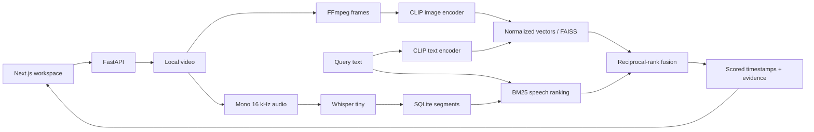

# SceneMind

**Search inside video using natural language.**

Upload a video, browse sampled moments, transcribe speech, and retrieve scenes using visual or combined visual/speech evidence. Selecting a result seeks the player to its timestamp. Open pretrained models run locally: no API key, subscription, cloud GPU, or paid AI service is required.


*Actual application with generated red/blue test footage. This illustrates the workflow, not real-world retrieval quality. [Mobile view](docs/images/workspace-mobile.png).*

## Implemented

- Bounded video upload, metadata, sampled frames and thumbnails.
- Local Whisper tiny speech transcription and timestamped transcript search.
- CLIP ViT-B/32 embeddings and exact FAISS cosine search.
- BM25 speech relevance and explainable reciprocal-rank fusion.
- Responsive library/player, processing states, three search modes and click-to-seek.
- SQLite transcript persistence with SQLAlchemy/Alembic migrations.
- Model-free unit tests, real-model smoke scripts, browser tests and a benchmark runner.

Core phases 0-6 and a bounded local hardening milestone are implemented. Optional operator authentication and durable workers are available; public deployment remains outside verified scope. See [status](PROJECT_STATUS.md).

## Run locally

Verified on Windows, Python 3.13 and Node.js 24. Setup targets Python 3.11-3.13 and Node.js 20.9+. Linux backend tests and PostgreSQL queue/migrations are also verified; actual ML inference is measured on Windows CPU.

From the repository root in PowerShell:

```powershell
py -3.13 -m venv .venv
.venv/Scripts/python -m pip install -r backend/requirements.lock
.venv/Scripts/python -m pip install -e "backend[dev]"
.venv/Scripts/python -m uvicorn app.main:app --reload
```

In a second terminal:

```powershell
cd frontend
npm ci
npm run dev
```

Open **http://localhost:3000**. API docs: **http://localhost:8000/docs**. Run the backend from the repository root so relative paths resolve consistently. Use one backend worker.

The base setup supports upload and frame browsing. Enable speech and visual search:

```powershell
.venv/Scripts/python -m pip install torch --index-url https://download.pytorch.org/whl/cpu
.venv/Scripts/python -m pip install -e "backend[speech,visual]"
```

Restart the backend. Upload/select a video, then choose **Build visual index** and/or **Transcribe video**. First use downloads weights into ignored `data/models`; later runs reuse them. CLIP weights are roughly 600 MB; Whisper tiny is much smaller. `backend/requirements-ml.lock` records the full verified Windows CPU environment.

On Linux/macOS, create the environment with `python3 -m venv .venv` and use `.venv/bin/python`. Install from `backend[dev]` instead of the Windows-specific lock.

## Evaluation and hardening

The [Natural V2 protocol](ml/evaluation/NATURAL_V2_PROTOCOL.md), [measured results](ml/evaluation/NATURAL_V2_RESULTS.md), and [failure analysis](ml/evaluation/FAILURE_ANALYSIS.md) cover the current natural-video benchmark. The earlier [evaluation/hardening guide](docs/learning/06-calibration-and-durable-workers.md) and [animated pilot](ml/evaluation/PILOT_RESULTS.md) remain as historical baselines.

For durable processing, set `SCENEMIND_DURABLE_JOBS=true`, stop the old inline API, then start the API and `.venv/Scripts/python -m app.worker` from the same repository root. Both processes must share database, data directory, cache and model configuration. Use one API process and one worker supervisor per host. Inspect `GET /jobs`; retry a failed job with `POST /jobs/{id}/retry`.

Optional settings: `SCENEMIND_JOB_TIMEOUT=900`, `SCENEMIND_JOB_ATTEMPTS=2`, `SCENEMIND_MAX_PENDING_JOBS=20`. Calibration stays off unless `SCENEMIND_CALIBRATION_PATH` points to a reviewed artifact. The pilot threshold reduced held-out false accepts from 4/4 to 2/4; it does not establish semantic absence.

Set a strong private `SCENEMIND_AUTH_TOKEN` for protected operator access. Open `http://localhost:8000/docs`, sign in through the browser prompt as `scenemind`, then open the frontend using the same hostname. Browser-managed credentials cover API/media requests; API tools can use Bearer authentication. Do not put passwords in frontend configuration. This is one operator, not a tenant/account system; use TLS before non-loopback access.

Run `python scripts/validate_containers.py` in the virtual environment for disposable Linux/PostgreSQL verification. Optional `compose.yaml` requires `SCENEMIND_DB_PASSWORD` and `SCENEMIND_AUTH_TOKEN` and binds the API to loopback. Use a URL-safe generated database password. The base image supports ingestion and mocked tests; install CPU speech/visual extras in a derived image for ML stages. Container ML and full Compose deployment are separate, unverified paths. Preserve persistent volumes.

For authenticated browser checks, set `SCENEMIND_E2E_AUTH` to a test-only password and `SCENEMIND_MODEL_E2E=1`, then run `npm run test:e2e` in `frontend`. These settings target only the isolated test backend.

## Configuration

Optional: copy `.env.example` to root `.env`, and `frontend/.env.example` to `frontend/.env.local`.

| Setting | Default | Purpose |
| --- | --- | --- |
| SCENEMIND_DATA_DIR | data/videos | Media and indexes |
| SCENEMIND_DATABASE_URL | sqlite:///data/scenemind.db | Transcript database |
| SCENEMIND_SAMPLING_INTERVAL | 5 | Seconds between frames |
| SCENEMIND_MAX_UPLOAD_BYTES | 262144000 | 250 MiB limit |
| SCENEMIND_MAX_DURATION | 1800 | Maximum duration in seconds |
| SCENEMIND_MODEL_CACHE | data/models | Model cache |
| SCENEMIND_MODEL_DEVICE | cpu | Inference device; CUDA unverified |
| SCENEMIND_SPEECH_MODEL | tiny | Whisper model or local directory |
| SCENEMIND_VISUAL_MODEL | openai/clip-vit-base-patch32 | CLIP checkpoint |
| SCENEMIND_VISUAL_REVISION | Pinned commit | Changing it requires reindexing |
| NEXT_PUBLIC_API_URL | http://localhost:8000 | Browser API origin |

FFmpeg comes from imageio-ffmpeg; IMAGEIO_FFMPEG_EXE overrides its executable. No system FFmpeg installation was needed on Windows. Accepted containers: MP4, MOV, WebM, MKV and AVI, up to 4K. MP4/H.264 is the practical browser playback path; other codecs depend on the browser.

## Architecture



Preprocessing, inference, normalization, retrieval and evaluation remain explicit. Models load once per process. Video manifests and embedding files are atomic; relational migrations run at startup. Inline mode marks interruptions failed; durable mode retries persisted jobs within the attempt budget. [Architecture](ARCHITECTURE.md) / [Decisions](DECISIONS.md).

## Validation and benchmarks

```powershell
./scripts/check.ps1
cd frontend
npx playwright install chromium
npm run test:e2e
```

Default browser tests generate a fixture and require no model weights. Set `$env:SCENEMIND_MODEL_E2E='1'` to include real CLIP browser tests. Standalone smoke tests: scripts/smoke_visual.py and scripts/smoke_speech.py.

Run the real local synthetic benchmark from the root:

```powershell
.venv/Scripts/python -m ml.evaluation.run --synthetic --k 1 --repeats 5
```

The measured two-color fixture achieved Recall@1 and MRR@1 of 1.0 on **two positive queries**, with roughly **15 ms warm in-process median search latency**. The one negative query still returned a result. These tiny synthetic results validate the pipeline, not real-world accuracy or network performance. [Exact results](ml/evaluation/RESULTS.md) / [Protocol and custom manifests](ml/evaluation/PROTOCOL.md).

Prepare and run the frozen natural-video benchmark:

```powershell
.venv/Scripts/python scripts/prepare_natural_v2.py
.venv/Scripts/python -m ml.evaluation.run_natural_v2 --repeats 3
.venv/Scripts/python -m ml.evaluation.regression_natural_v2 data/natural-v2-report.json ml/evaluation/reports/natural-v2.json
```

Natural V2's raw held-out visual R@5 is 85.7%, but nearest-neighbor retrieval accepts every negative. The calibration-only cutoff lowers negative FAR@5 to 10% while lowering R@5 to 38.1% and causing 52.4% positive false abstention. Speech reaches 80% R@5 with 0% negative FAR on its small slice. These are diagnostic results from three held-out videos, not population estimates.

## Learn the AI pipeline

1. [Video processing](docs/learning/01-video-processing.md)
2. [Timestamped speech](docs/learning/02-speech-transcription.md)
3. [CLIP embeddings](docs/learning/03-clip-and-multimodal-embeddings.md)
4. [Vector retrieval](docs/learning/04-vector-search.md)
5. [Hybrid ranking](docs/learning/05-hybrid-retrieval.md)

CLIP and faster-whisper sources publish MIT licensing; consult model cards and retain notices when redistributing. No weights are vendored. FFmpeg licensing depends on the selected build.

## Limitations and next work

- Static frames can miss brief events and do not establish actions or causality.
- Scores are rankings, not probabilities. The opt-in no-match threshold transfers poorly across Natural V2 domains.
- Whisper tiny can mistranscribe; lexical speech search misses paraphrases.
- VFR duration is approximate. A speech result's thumbnail may represent a nearby time.
- Operator authentication and durable worker deadlines are optional. Multi-user quotas, distributed coordination and public deployment are outside scope. Keep the service bound to localhost.
- Natural V2 is too small for broad quality claims; expand frozen source-disjoint calibration and held-out coverage.

OCR, scene detection, grounded Q&A and specialization are planned only where they improve a concrete use case. Fine-tuning requires a dataset and measured baseline first. [Roadmap](PROJECT_PLAN.md) / [Tasks](TASKS.md). Facial identity recognition is outside scope.
