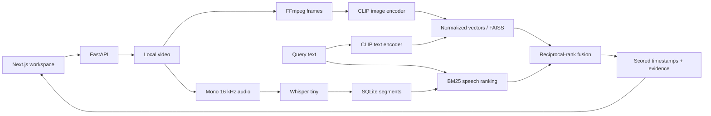

# SceneMind

**Search inside video using natural language.**

Upload a video, browse sampled moments, transcribe English speech, and retrieve scenes using visual or combined visual/speech evidence. Selecting a result seeks the player to its timestamp. SceneMind v1.0 is English-first. Open pretrained models run locally: no API key, subscription, cloud GPU, or paid AI service is required.


*Actual application with generated red/blue test footage. This illustrates the workflow, not real-world retrieval quality. [Mobile view](docs/images/workspace-mobile.png).*

## Implemented

- Bounded video upload, metadata, sampled frames and thumbnails.
- Local Whisper tiny speech transcription and timestamped transcript search.
- CLIP ViT-B/32 embeddings and exact FAISS cosine search.
- BM25 speech relevance and explainable reciprocal-rank fusion.
- Responsive library/player, durable processing states, three clear v1.0 search modes, and click-to-seek.
- SQLite transcript persistence with SQLAlchemy/Alembic migrations.
- Model-free unit tests, real-model smoke scripts, browser tests and a benchmark runner.

Core phases 0-6 and a bounded local hardening milestone are implemented. Optional operator authentication and durable workers are available; public deployment remains outside verified scope. See [status](PROJECT_STATUS.md).

Search results are ranked candidate moments, not confirmed answers. The UI presents “Most relevant moments,” keeps useful transcript excerpts and evidence labels, and does not expose raw model scores. SceneMind cannot reliably determine that requested content is absent; it returns possible moments with one restrained relevance explanation.

SceneMind v1.0 defaults to **Smart Search**, which uses the existing Hybrid retrieval path across speech and visuals. **Spoken Content** maps to Speech retrieval and **Visual Content** maps to Visual retrieval. The historical AUTO classifier remains API-compatible for experiments and existing clients, but it is not exposed in the normal frontend or recommended for v1.0. Human-grounded validation measured only 48.33% accuracy for the current router and 60.00% for the best lightweight candidate. The [Final Acceptance V2 plan](ml/evaluation/FINAL_ENGLISH_ACCEPTANCE_V2_PLAN.md) therefore evaluates Smart Search directly without scoring AUTO.

Validated claims are local multimodal retrieval with CLIP visual search, Whisper speech indexing, BM25/RRF hybrid ranking, benchmark-driven evaluation, measured latency/memory, and long-video processing infrastructure. SceneMind does not claim reliable automatic route selection, no-match detection, multilingual robustness, OCR or action understanding, Video RAG, broad production readiness, or 60-minute search quality.

## Run locally

Verified on Windows, Python 3.13 and Node.js 24. Setup targets Python 3.11-3.13 and Node.js 20.9+. Linux backend tests and PostgreSQL queue/migrations are also verified; actual ML inference is measured on Windows CPU.

From the repository root in PowerShell:

```powershell
py -3.13 -m venv .venv
.venv/Scripts/python -m pip install -r backend/requirements.lock
.venv/Scripts/python -m pip install -e "backend[dev]"
.venv/Scripts/python -m uvicorn app.main:app --reload
```

In a second terminal:

```powershell
cd frontend
npm ci
npm run dev
```

Open **http://localhost:3000**. API docs: **http://localhost:8000/docs**. Run the backend from the repository root so relative paths resolve consistently. Use one backend worker.

The base setup supports upload and frame browsing. Enable speech and visual search:

```powershell
.venv/Scripts/python -m pip install torch --index-url https://download.pytorch.org/whl/cpu
.venv/Scripts/python -m pip install -e "backend[speech,visual]"
```

Restart the backend. Upload/select a video, then choose **Build visual index** and/or **Transcribe video**. First use downloads weights into ignored `data/models`; later runs reuse them. CLIP weights are roughly 600 MB; Whisper tiny is much smaller. `backend/requirements-ml.lock` records the full verified Windows CPU environment.

On Linux/macOS, create the environment with `python3 -m venv .venv` and use `.venv/bin/python`. Install from `backend[dev]` instead of the Windows-specific lock.

## Evaluation and hardening

The [Natural V2 protocol](ml/evaluation/NATURAL_V2_PROTOCOL.md), [measured results](ml/evaluation/NATURAL_V2_RESULTS.md), and [failure analysis](ml/evaluation/FAILURE_ANALYSIS.md) cover the current natural-video benchmark. The earlier [evaluation/hardening guide](docs/learning/06-calibration-and-durable-workers.md) and [animated pilot](ml/evaluation/PILOT_RESULTS.md) remain as historical baselines.

The follow-up [image-text verifier experiment](ml/experiments/image_text_verifier/README.md) tested BLIP ITM over CLIP's top five using an expanded calibration pool. It failed promotion: calibrated R@5 was 26.2%, positive false abstention 52.4%, and added CPU median latency 3.352 seconds. [Results](ml/evaluation/VERIFIER_RESULTS.md) and [reviewed failures](ml/evaluation/VERIFIER_FAILURE_ANALYSIS.md) document why production remains unchanged.

The [lightweight scorer experiment](ml/experiments/lightweight_pair_scorer/README.md) added 20 frozen small-object/relation queries and tested UForm3-small ONNX plus an eight-parameter CLIP-statistics scorer. UForm meets resources at 202.1 ms median, 229.1 ms p95 and 163.1 MB isolated peak delta, but its 0% FAR costs 47.6% positive false abstention. The tiny scorer costs 0.066 ms but reaches 71.4% abstention. [Results](ml/evaluation/LIGHTWEIGHT_PAIR_SCORER_RESULTS.md), [failures](ml/evaluation/LIGHTWEIGHT_PAIR_SCORER_FAILURES.md), and the [model shortlist](ml/experiments/lightweight_pair_scorer/MODEL_SHORTLIST.md) record the rejection. Production remains CLIP/BM25/RRF.

The [object-detector branch](ml/experiments/object_detector_branch/README.md) tested official YOLOX-Nano ONNX only on frozen CLIP top-five frames. It is efficient at 90.5 ms warm median, 99.6 ms p95 and 58.0 MiB added peak RSS, but its calibration-only threshold abstains on all three small-object positives. [Results](ml/evaluation/OBJECT_DETECTOR_RESULTS.md), [failures](ml/evaluation/OBJECT_DETECTOR_FAILURES.md), and the [shortlist](ml/experiments/object_detector_branch/MODEL_SHORTLIST.md) document the rejection. No detector code or dependency entered production.

The [bounded secondary experiment](ml/experiments/bounded_secondary_sampling/README.md) tested top-5/10/20 coarse expansion, ±2/4/6-second windows, a versioned two-second JPEG cache, secondary CLIP and Nano 640. The selected top-5 ±2-second policy averages nine frames, but reaches only 50% of verified held-out visible evidence; secondary CLIP reaches 0% there, and strict no-match gating abstains on every small-object query. [Results](ml/evaluation/BOUNDED_SECONDARY_RESULTS.md) and [failures](ml/evaluation/BOUNDED_SECONDARY_FAILURES.md) select coarse candidate generation as the next bottleneck. Production remains unchanged.

The [coarse candidate diversity experiment](ml/experiments/coarse_candidate_diversity/README.md) measures top-20/top-50 redundancy and compares temporal NMS, MMR, embedding-change grouping and bounded multi-scale sampling. The selected cheap policy removes neighboring duplicates but reaches only 81.0% held-out R@5 versus the 85.7% five-second baseline and does not improve reviewed small-object recall. The raw two-second top-50 pool reaches 97.6% correct-region recall, so [results](ml/evaluation/COARSE_CANDIDATE_RESULTS.md) and [failures](ml/evaluation/COARSE_CANDIDATE_FAILURES.md) recommend a bounded candidate-list ranking/no-match experiment. Production remains unchanged.

For durable processing, set `SCENEMIND_DURABLE_JOBS=true`, stop the old inline API, then start the API and `.venv/Scripts/python -m app.worker` from the same repository root. Both processes must share database, data directory, cache and model configuration. Use one API process and one worker supervisor per host. Inspect `GET /jobs`; retry a failed job with `POST /jobs/{id}/retry`.

Optional durable settings include `SCENEMIND_INGEST_JOB_TIMEOUT=1800`, `SCENEMIND_SPEECH_JOB_TIMEOUT=7200`, `SCENEMIND_VISUAL_JOB_TIMEOUT=3600`, `SCENEMIND_JOB_ATTEMPTS=2`, and `SCENEMIND_MAX_PENDING_JOBS=20`. Calibration stays off unless `SCENEMIND_CALIBRATION_PATH` points to a reviewed artifact. The pilot threshold reduced held-out false accepts from 4/4 to 2/4; it does not establish semantic absence.

Set a strong private `SCENEMIND_AUTH_TOKEN` for protected operator access. Open `http://localhost:8000/docs`, sign in through the browser prompt as `scenemind`, then open the frontend using the same hostname. Browser-managed credentials cover API/media requests; API tools can use Bearer authentication. Do not put passwords in frontend configuration. This is one operator, not a tenant/account system; use TLS before non-loopback access.

Run `python scripts/validate_containers.py` in the virtual environment for disposable Linux/PostgreSQL verification. Optional `compose.yaml` requires `SCENEMIND_DB_PASSWORD` and `SCENEMIND_AUTH_TOKEN` and binds the API to loopback. Use a URL-safe generated database password. The base image supports ingestion and mocked tests; install CPU speech/visual extras in a derived image for ML stages. Container ML and full Compose deployment are separate, unverified paths. Preserve persistent volumes.

For authenticated browser checks, set `SCENEMIND_E2E_AUTH` to a test-only password and `SCENEMIND_MODEL_E2E=1`, then run `npm run test:e2e` in `frontend`. These settings target only the isolated test backend.

## Configuration

Optional: copy `.env.example` to root `.env`, and `frontend/.env.example` to `frontend/.env.local`.

| Setting | Default | Purpose |
| --- | --- | --- |
| SCENEMIND_DATA_DIR | data/videos | Media and indexes |
| SCENEMIND_DATABASE_URL | sqlite:///data/scenemind.db | Transcript database |
| SCENEMIND_SAMPLING_INTERVAL | 5 | Seconds between frames |
| SCENEMIND_MAX_UPLOAD_BYTES | 1073741824 | 1 GiB streamed-upload limit |
| SCENEMIND_MAX_DURATION | 3600 | Maximum duration in seconds |
| SCENEMIND_MIN_FREE_DISK_BYTES | 536870912 | Free disk reserve |
| SCENEMIND_PROCESSING_DISK_HEADROOM_RATIO | 0.25 | Derived-file headroom relative to source bytes |
| SCENEMIND_MODEL_CACHE | data/models | Model cache |
| SCENEMIND_MODEL_DEVICE | cpu | Inference device; CUDA unverified |
| SCENEMIND_SPEECH_MODEL | tiny | Whisper model or local directory |
| SCENEMIND_VISUAL_MODEL | openai/clip-vit-base-patch32 | CLIP checkpoint |
| SCENEMIND_VISUAL_REVISION | Pinned commit | Changing it requires reindexing |
| SCENEMIND_AUTO_ROUTING_ENABLED | true | AUTO classifier; false falls back to Hybrid |
| NEXT_PUBLIC_API_URL | http://localhost:8000 | Browser API origin |

FFmpeg comes from imageio-ffmpeg; IMAGEIO_FFMPEG_EXE overrides its executable. No system FFmpeg installation was needed on Windows. Accepted containers: MP4, MOV, WebM, MKV and AVI, up to 4K. MP4/H.264 is the practical browser playback path; other codecs depend on the browser.

## Architecture



Preprocessing, inference, normalization, retrieval and evaluation remain explicit. Models load once per process. Video manifests and embedding files are atomic; relational migrations run at startup. Inline mode marks interruptions failed; durable mode retries persisted jobs within the attempt budget. [Architecture](ARCHITECTURE.md) / [Decisions](DECISIONS.md).

## Validation and benchmarks

```powershell
./scripts/check.ps1
cd frontend
npx playwright install chromium
npm run test:e2e
```

Default browser tests generate a fixture and require no model weights. Set `$env:SCENEMIND_MODEL_E2E='1'` to include real CLIP browser tests. Standalone smoke tests: scripts/smoke_visual.py and scripts/smoke_speech.py.

Run the real local synthetic benchmark from the root:

```powershell
.venv/Scripts/python -m ml.evaluation.run --synthetic --k 1 --repeats 5
```

The measured two-color fixture achieved Recall@1 and MRR@1 of 1.0 on **two positive queries**, with roughly **15 ms warm in-process median search latency**. The one negative query still returned a result. These tiny synthetic results validate the pipeline, not real-world accuracy or network performance. [Exact results](ml/evaluation/RESULTS.md) / [Protocol and custom manifests](ml/evaluation/PROTOCOL.md).

Prepare and run the frozen natural-video benchmark:

```powershell
.venv/Scripts/python scripts/prepare_natural_v2.py
.venv/Scripts/python -m ml.evaluation.run_natural_v2 --repeats 3
.venv/Scripts/python -m ml.evaluation.regression_natural_v2 data/natural-v2-report.json ml/evaluation/reports/natural-v2.json
```

Natural V2's raw held-out visual R@5 is 85.7%, but nearest-neighbor retrieval accepts every negative. The calibration-only cutoff lowers negative FAR@5 to 10% while lowering R@5 to 38.1% and causing 52.4% positive false abstention. Speech reaches 80% R@5 with 0% negative FAR on its small slice. These are diagnostic results from three held-out videos, not population estimates.

The candidate-list follow-up found 92.9%/100% held-out Oracle recall at top-20/top-50, but calibration-selected list features lowered final R@5 to 76.2% and a no-match threshold falsely rejected 90.5% of positives. Existing explicit Visual/Speech/Hybrid routing with real BM25 evidence reached 95.2% R@5. Production therefore keeps raw five-second CLIP ordering and explicit modes. [Candidate-list results](ml/evaluation/CANDIDATE_LIST_RANKING_RESULTS.md).

The historical AUTO routing milestone uses a frozen 54-parameter text-only classifier trained on 36 balanced queries from three additional Commons sources. Held-out AUTO R@5 was 95.2%, matching explicit routing, with 0.031 ms median routing latency; a second run matched. Later real-video validation invalidated AUTO as the product default, so the implementation remains compatible while the v1.0 interface uses the three direct modes above. [Routing results](ml/evaluation/QUERY_ROUTING_RESULTS.md) / [personal acceptance protocol](ml/evaluation/PERSONAL_VIDEO_ACCEPTANCE_PROTOCOL.md).

The first real [personal acceptance run](ml/evaluation/PERSONAL_ACCEPTANCE_RESULTS.md) froze 54 English/Turkish queries before searching the three supplied videos. Positive useful Top-1/3/5 was 52.8%/66.7%/83.3%, AUTO routing was 77.8%, and search latency was 23.25/32.02 ms median/p95. English Top-5 reached 88.9%; Turkish reached 77.8%, and all 12 route errors were Turkish. Only 22.2% of negatives avoided a misleading response. The measured outcome is C — not yet accepted. Production remains unchanged; see the [failure analysis](ml/evaluation/PERSONAL_ACCEPTANCE_FAILURES.md).

[Long-video infrastructure](ml/evaluation/LONG_VIDEO_INGEST_RESULTS.md) now accepts a configurable 1 GiB / 60-minute envelope through streamed disk writes and durable jobs. The original 419 MiB tutorial completed normally without transcoding, and a 45-minute audio stress fixture completed Whisper plus CLIP indexing. Peak measured worker-tree RSS was 3.02 GB; no temporary artifacts remained. This validates processing infrastructure, not long-video search accuracy. Configuration and operational details are in [long-video support](docs/LONG_VIDEO_SUPPORT.md).

[Final English long-video acceptance](ml/evaluation/FINAL_ENGLISH_ACCEPTANCE_RESULTS.md) used a new real CC BY 4.0 54:11 technical presentation and 30 queries frozen before product search. The normal durable pipeline completed with 651 frames, 684 English segments, no failure, and no temporary residue. Search failed the v1.0 gates: AUTO routing was 56.67%, and positive useful Top-1/3/5 was 50.00%/65.38%/65.38%. Clear Visual slides were much stronger at 83.33% Top-5, while Speech AUTO was 30%. Conservative behavior was acceptable on all four confirmed negatives. Decision C leaves production unchanged and identifies one blocker: AUTO routing generalization on natural English interrogative technical queries.

The bounded [English router generalization study](ml/evaluation/ENGLISH_ROUTER_GENERALIZATION_RESULTS.md) freezes 450 balanced queries across 15 source scenarios. Production AUTO reaches 50.00% frozen routing accuracy. A dependency-free character n-gram linear candidate reaches 95.56%, with 100.00%/90.00%/96.67% Visual/Speech/Hybrid recall and 2.7706/3.3677 ms median/p95 latency. It is not promoted: the scenarios were independently authored but not verified against real video evidence, and validation-selected Hybrid fallback lowered raw frozen accuracy from 97.78% to 95.56%. Decision E preserves the existing router and all retrieval behavior; new real-video source groups are required.

The subsequent [human-grounded router validation](ml/evaluation/HUMAN_GROUNDED_ROUTER_RESULTS.md) reviews frames and local transcripts from ten new openly licensed videos and freezes 360 balanced queries with two unseen test videos. Production scores 48.33%; the fixed character candidate scores 60.00%, with 50.00%/40.00%/90.00% Visual/Speech/Hybrid recall. It is fast at 1.626/1.928 ms median/p95 but fails three quality gates. Decision C keeps the production router and all retrieval behavior unchanged; no second run or Final English Acceptance V2 is scheduled.

The [final English acceptance preparation](ml/evaluation/FINAL_ENGLISH_ACCEPTANCE_PREPARATION.md) records the earlier inventory decision D, before eligible media was supplied. Its validator, templates, and [protocol](ml/evaluation/FINAL_ENGLISH_ACCEPTANCE_PROTOCOL.md) were then used for the completed run above.

The source-disjoint [Turkish compatibility study](ml/evaluation/TURKISH_COMPATIBILITY_RESULTS.md) used 72 natural queries across six development source groups without tuning on personal acceptance. Cheap routing improved held-out Turkish route accuracy from 53.3% to 76.7%, but missed the 90% gate; cheap AUTO R@5 reached 80%, below its 85% gate. Direct Turkish Visual R@5 was already 93.3%. A multilingual Speech diagnostic reached 100% R@5 but did not fix routing and added about 254 MiB RSS. Outcome E keeps production unchanged, skips the personal rerun and does not claim reliable Turkish support for v1.0. See the [failure analysis](ml/evaluation/TURKISH_COMPATIBILITY_FAILURES.md).

The English [path-aware no-match study](ml/evaluation/PATH_AWARE_NO_MATCH_RESULTS.md) freezes 120 balanced queries across six source-disjoint groups. AUTO routing reaches 95.83%, but Visual rejection falsely abstains on 83.33% of positives while Speech and Hybrid accept 33.33% and 50.00% of negatives. Overall R@5 falls from 87.50% to 41.67%. Outcome E keeps production unchanged, skips the second/personal runs, and ends no-match model experimentation for v1.0. Search results should be read as likely moments rather than confirmed answers.

## Learn the AI pipeline

1. [Video processing](docs/learning/01-video-processing.md)
2. [Timestamped speech](docs/learning/02-speech-transcription.md)
3. [CLIP embeddings](docs/learning/03-clip-and-multimodal-embeddings.md)
4. [Vector retrieval](docs/learning/04-vector-search.md)
5. [Hybrid ranking](docs/learning/05-hybrid-retrieval.md)

CLIP and faster-whisper sources publish MIT licensing; consult model cards and retain notices when redistributing. No weights are vendored. FFmpeg licensing depends on the selected build.

## Limitations and next work

- Static frames can miss brief events and do not establish actions or causality.
- Scores are rankings, not probabilities. Global and path-aware no-match rules both fail frozen transfer gates and are not production confidence estimates.
- Whisper tiny can mistranscribe; lexical speech search misses paraphrases.
- VFR duration is approximate. A speech result's thumbnail may represent a nearby time.
- Operator authentication and durable worker deadlines are optional. Multi-user quotas, distributed coordination and public deployment are outside scope. Keep the service bound to localhost.
- Natural V2 is too small for broad quality claims; expand frozen source-disjoint calibration and held-out coverage.
- AUTO can select the existing search path for represented English query forms, but Turkish routing and retrieval missed personal-use targets. Infrastructure now processes 1 GiB / 60-minute inputs and passed a 45-minute stress run, but the supplied personal videos still do not verify 30–60 minute search usefulness. Keep explicit overrides and avoid v1.0 reliability claims until the frozen acceptance gates pass.

OCR, scene detection, grounded Q&A and specialization are planned only where they improve a concrete use case. Fine-tuning requires a dataset and measured baseline first. [Roadmap](PROJECT_PLAN.md) / [Tasks](TASKS.md). Facial identity recognition is outside scope.

SceneMind v1.0 is English-first. Turkish code and research remain available, but robust Turkish or multilingual search is not a validated product claim.
