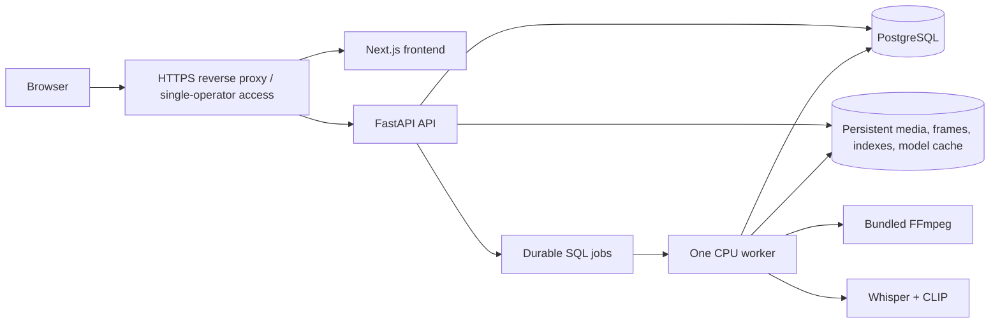

# SceneMind deployment

SceneMind v1.0 is a **single-operator, English-first video search application**.
It is not a stateless Next.js page or a multi-tenant SaaS. Do not expose the
FastAPI port or media volume directly to the public internet. The production
search path is five-second frames → CLIP/FAISS, audio → Whisper/BM25, and
Smart Search → uncapped RRF60. Ask Video and OCR remain disabled research.
OpenAI credentials are not needed for production Find Moments.

## Practical layout



The API and worker must use the same PostgreSQL database, model settings and
persistent `/app/data` volume. PostgreSQL needs its own durable volume and
backups. The current `compose.yaml` binds the API to `127.0.0.1:8000`; place
an HTTPS proxy on the same host for remote access. Run one worker initially to
avoid concurrent CPU/RAM pressure. Host the frontend as a Node service behind
the same proxy. Build it with `NEXT_PUBLIC_API_URL` set to the externally
reachable API URL. That value is embedded at Next.js build time. Set
`SCENEMIND_CORS_ORIGINS` to the exact frontend origin, as a JSON array such as
`["https://scene.example"]`. Check both frontend and API routes through the
proxy, including Range requests for `/videos/{id}/media` and frame thumbnails.

## Local reproducibility

Python 3.11–3.13, Node.js 20+, npm, Docker Compose (for PostgreSQL deployment),
and network access for the first model download are required. The Python
`imageio-ffmpeg` package supplies FFmpeg. CPU is the default; a GPU requires a
separately compatible PyTorch/CTranslate2 installation and setting.

```powershell
python -m venv .venv
.venv\Scripts\python -m pip install -e "./backend[dev,postgres,speech,visual]"
cd frontend
npm ci
cd ..
```

For a local single-process trial, copy `.env.example` to ignored `.env.local`,
keep `SCENEMIND_DURABLE_JOBS=false`, run
`.venv\Scripts\python -m uvicorn app.main:app --app-dir backend --host 127.0.0.1 --port 8000`,
then `cd frontend; npm run dev`. For durable processing, set
`SCENEMIND_DURABLE_JOBS=true` in both processes and run
`.venv\Scripts\python -m app.worker` with `PYTHONPATH=backend` or from the
`backend` directory. Configure a PostgreSQL `SCENEMIND_DATABASE_URL` in both.

For the Compose stack, supply private `SCENEMIND_DB_PASSWORD` and
`SCENEMIND_AUTH_TOKEN` environment variables and run `docker compose up -d
--build`; keep those values out of Git and logs. The Docker image installs the
Speech and Visual extras. It does **not** build or serve the separate Next.js
frontend. `/health` reports API liveness; check the worker and queued jobs
separately. Models download into persistent `data/models` on first use. Cache
the pinned CLIP revision and Whisper model before an offline deployment.

## Persistence, limits and resource planning

The API streams uploaded media into UUID-owned directories. The worker stores
original video, 480-pixel JPEG frames, CLIP embeddings and status files on the
shared volume; transcript segments and durable jobs live in SQL. Back up the
database **and** media volume consistently. Restart recovery and atomic writes
avoid treating partial frames/indexes as ready. Remote acquisitions stage into
the same volume; byte/duration limits and disk reserve apply. Default bounds
are 1 GiB per upload, 60 minutes, 4K source dimensions, 512 MiB free-disk
reserve, 25% processing headroom, and bounded per-stage deadlines/retries.

Measured prior durable-worker runs: a 22.8-minute real silent video used
1.149 GB peak worker process-tree RSS and 444.8 MB persistent disk; a 45-minute
repeated-fixture speech+visual run used 3.018 GB peak worker RSS, 1.563 GB
steady worker RSS, 173.4 MB disk and 245.4 seconds total processing. API upload
peak was about 110 MB in those runs. These are **measurements for those sources**,
not universal per-video predictions. The final acceptance run reports separate
source measurements. Model cache and database sizes vary; inspect the local
volume before sizing storage. A starting single-operator host of at least 4
vCPU, 8 GB RAM and tens of GB of persistent disk is an **operational estimate**,
not a tested minimum. Allow more headroom if the API and worker each load CLIP
or several jobs are queued. Set a disk/CPU/RAM quota and monitor queue depth.

## Security and operational boundaries

Use HTTPS and a strong single-operator token. The built-in HTTP Basic/Bearer
gate is not tenant isolation, user management or rate limiting; add those at a
trusted proxy before any broader exposure. Configure exact CORS origins. Do
not pass secrets to the frontend or set `OPENAI_API_KEY` for Find Moments.
URL import permits supported HTTP(S) media and public YouTube URLs. Submitted
hosts and direct-media redirects are revalidated against public IP addresses;
private, loopback, link-local, reserved and credential-bearing URLs are rejected.
Transfers are size/time bounded, local media is validated again, and partial
downloads/staged artifacts are cleaned after failure. See [URL ingestion](URL_INGESTION.md).
Provider availability and public-video rights remain external constraints.

Before opening a deployment to anyone else, run pytest, Ruff, ESLint,
TypeScript, a production Next.js build, Playwright, an actual browser upload,
URL import, search/seek, a restart/persistence check and a backup restore.
`docker compose config --quiet` validates interpolation, but it does not prove
that the image builds or models run. The release report records which checks
were actually executed.
